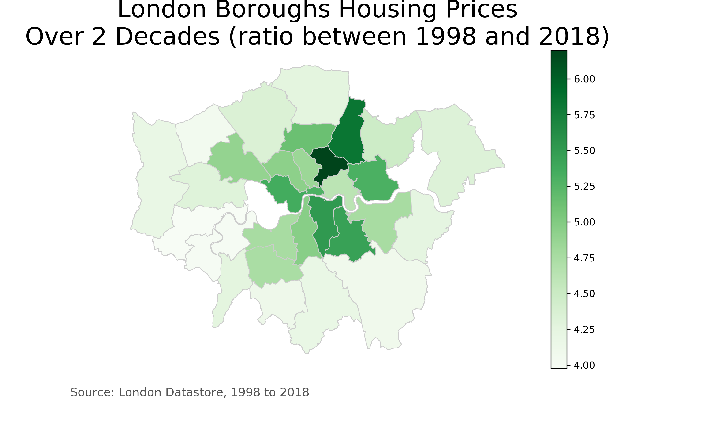

# London-Borough-Housing-Prices

## Which boroughs of London have seen the greatest increase in housing prices, on average, over the last two decades?

#### What did you find? Which borough is the most expensive? Any other interesting trends?

The three boroughs of London that has seen the greatest increase in housing prices, on average, over the last two decades are Hackney with 6.2 times more than their 1998 values, Waltham Forest with 5.8 times more than their 1998 values, and Southwark with 5.5 times more than their 1998 values. On average the boroughs increased by a factor of 4.7 +/- 0.57 times more than their 1998 values. 
The most expensive boroughs are Kensington & Chelsea being first, then Westminster, then Camden. 

By mapping out the increase in housing prices, we can see that the central London area has had the largest increase. The surrounding boroughs of London all increased by 4-5 times their original 1998 price. I also noticed that the North increased slightly higher than the south and the west increased slightly higher than the east.

#### How did you arrive at your conclusion?

After doing some DataFrame cleaning, I calculated the housing price ratio comparing 1998 to 2018. Then I ranked the boroughs of London by the ratio to see which one had the largest increase. 

#### What were the main challenges you encountered? How did you overcome them? What could you not overcome?
The most challenging part was building the map with geopandas. I had never used the library before and ran into some bugs. After findingt the solution on StackOverflow it was smooth sailing.

#### Is there anything you’d like to investigate deeper?
I think it might be interesting to dive deeper into the education quality in those areas along with crime rate to see how much each might correlate to the increase in housing prices or in the rate at which a borough might grow.
